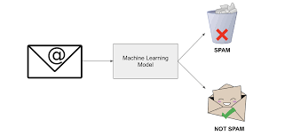

# MLOps Zoomcamp Final Project


# About the project

This is the final project for the course mlops-zoomcamp from [DataTalksClub](https://github.com/DataTalksClub/mlops-zoomcamp)

**Spam Email Detection** is a machine learning project aimed at classifying emails as either spam or legitimate (ham) based on their content. The project utilizes natural language processing techniques and classification algorithms to automatically identify and filter out unwanted spam emails from your inbox.




- **Dataset**: The project employs a diverse dataset of labeled email messages, consisting of both spam and ham examples. This dataset serves as the foundation for training and evaluating the machine learning model.

    [Dataset](https://www.kaggle.com/datasets/mfaisalqureshi/spam-email)


## Getting Started

1. **Clone the Repository**: Start by cloning this repository to your local machine.
   ```bash
   git clone https://github.com/JVAparicio/DE_Zoomcamp_Final_Project.git
2. **Create a virtual environment and start it**
    ```bash
    pipenv --dev
    pipenv shell
3. **Start mlflow**
    ```bash
    mlflow ui --backend-store-uri sqlite:///mlflow.db
4. **Start the prefect server**
    ```bash
    prefect orion start
5. **Run the preprocessing (make sure the file used for this project is in place /data/raw/spam.csv)***
    ```bash
    python3 src/etl/preprocessing.py
6. **Run the model experimenting script (it will create 3 experiments with 3 different models)**
    ```bash
    python3 src/etl/experimenting.py
* Check the mlflow ui to see the experiments http://127.0.0.1:5000/#/

7. **Register the best model (will also copy the pkl file of the best model to the deployment folder)**
    ```bash
    python3 src/etl/register_best_model.py
8. **Deploy the best model using docker and fastapi**
    ```bash
    docker build -f DockerFile -t spam_detector .
    docker run -p 8001:8001 spam_detector
* You can now access the following URL to the the predictions
    http://localhost:8001/predict?email="add your email here to test it"

    Examples:   

        http://localhost:8001/predict?email="Dear all, Hope you're doing well. I'm writing the email for the following reasons"
        http://localhost:8001/predict?email="We tried to call, reply to our sms for a free iphone mobile. Please call now 1234567 for delivery tomorrow"

9. **Run the monitoring report**
    ```bash
    python3 src/etl/monitoring.py
* Report is available on directory /data/report


**Other consideration**
    Unit tests: Unit tests are provided using pytest
    Code formatter: used black for consistent code style
